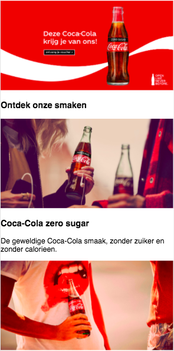
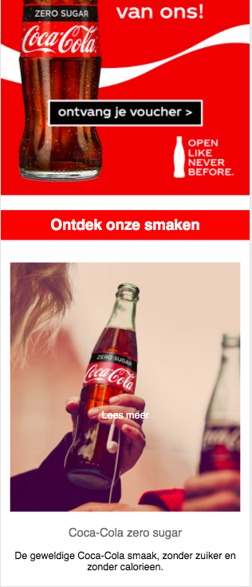
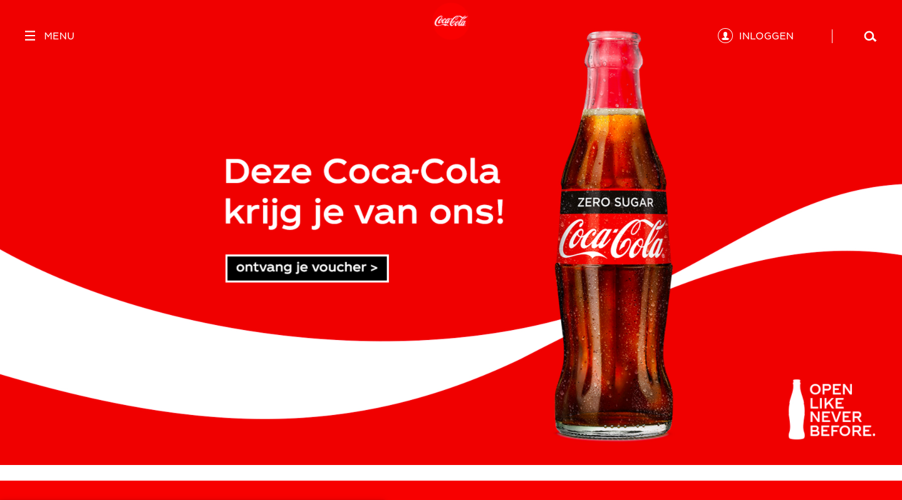
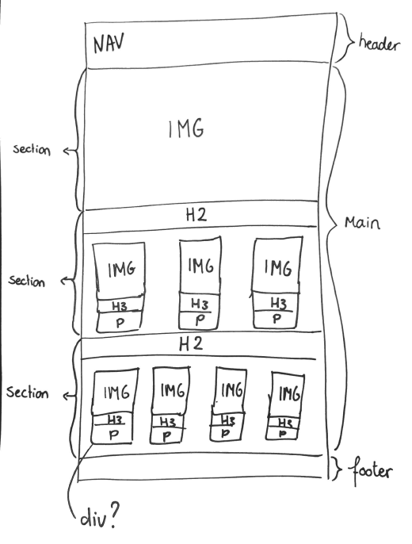

# Procesverslag
**Auteur:** -Jade Dionisio Pires-

Markdown cheat cheet: [Hulp bij het schrijven van Markdown](https://github.com/adam-p/markdown-here/wiki/Markdown-Cheatsheet). Nb. de standaardstructuur en de spartaanse opmaak zijn helemaal prima. Het gaat om de inhoud van je procesverslag. Besteedt de tijd voor pracht en praal aan je website.

## Bronnenlijst
1. - https://www.digitalocean.com/community/tutorials/css-cropping-images-object-fit -
2. - https://stackoverflow.com/questions/14263594/how-to-show-text-on-image-when-hovering#:~:text=Wrap%20the%20image%20and%20the,appear%20while%20hovering%20that%20div.&text=You%20can%20also%20do%20the,alt%20text%20of%20your%20image. -

## Eindgesprek (week 7/8)

-dit ging goed & dit was lastig-

**Screenshot(s):**

-screenshot(s) van je eindresultaat-

## Voortgang 3 (week 6)

-same as voortgang 1-

## Voortgang 2 (week 5)

-same as voortgang 1-

## Voortgang 1 (week 3)

### Stand van zaken

-dit ging goed & dit was lastig -

Week 1 
In week 1 heb ik de huiswerkopdrachten gemaakt, wat best goed verliep. Ik heb gekozen om de Coca-Cola website na te maken en heb de read-me ingevuld, aan de html/css/java heb ik niks toegevoegd. Met de huiswerkoefeningen heb ik geleerd hoe ik teksten kan aanpassen. Helaas kon ik die week niet bij de werkgroep zijn dus heb ik daar ook niets toegevoegd aan mijn werk.  

Week 2
Deze week heb ik de oefeningen over positionering gemaakt en heb ik super veel geleerd over de plaatsing van de elementen, dit ging erg goed. Danny raadde ons aan om alvast te beginnen met onze eigen website en dat heb ik ook gedaan. Ik had de basis van HTML, de kopjes p en afbeeldingen, toegevoegd en had de CSS even achterwege gelaten. Dit kostte helaas meer tijd dan ik had verwacht waardoor ik geen tijd heb gehad om te oefenen met flexbox. Wel heb ik de theorie doorgenomen. Ik ben van plan de oefeningen op een ander moment alsnog te maken.

Week 3
Deze week heb ik oefeningen van Javascript gemaakt en ik moet eerlijk zeggen dat ik er helemaal draaierig van werd. Tijdens de werkgroep legde Danny gelukkig duidelijk uit hoe alles werkte, zodat ik het beter begreep. De rest van de week heb ik hard aan mijn eigen website gewerkt. Ik begon met de navigatie, die een hamburger menu heeft, maar begreep er al vrij snel niets van. Ik heb ervoor gekozen mij dus eerst te gaan richten op de rest van de website, wat gelukkig erg goed ging en ik kreeg weer wat hoop. Ik heb toegepast wat ik vorige week heb geleerd m.b.t positionering en teksten. Zo heb ik d.m.v positionering tekst op afbeelding zichtbaar gemaakt met een hover. Ook heb ik de vormgeving iets mooier gemaakt. De mobile first van de eerste pagina is nu zo goed als af, op de navigatie na. Ik ben van plan eerst de flexbox opdrachten van week 2 te maken en als ik het dan nog niet begrijp hulp te vragen aan een docent assistent. 

### Agenda voor meeting

Jan Willem van Kempen 
Items (list) naast elkaar plaatsen, witte regels tussen afbeeldingen, tekst verdwijnen achter afbeeldingen

Souraya Hammaoui 
Grid, carrousel

Walter van Koesveld
Bovenstaande punten

Jade Dionisio Pires
Navigatie in header en footer

### Verslag van meeting

-na afloop snel uitkomsten vastleggen-

## Intake (week 1)

**Je startniveau:** blauw / rood

**Je focus:** -Responsive-

**Je opdracht:** -https://www.cocacola.nl/nl/home/-

**Screenshot(s):**

 (images/ScreensHome2.png) (images/ScreensHome3.png) (images/ScreensTweedepagina.png)

**Breakdown-schets(en):**

