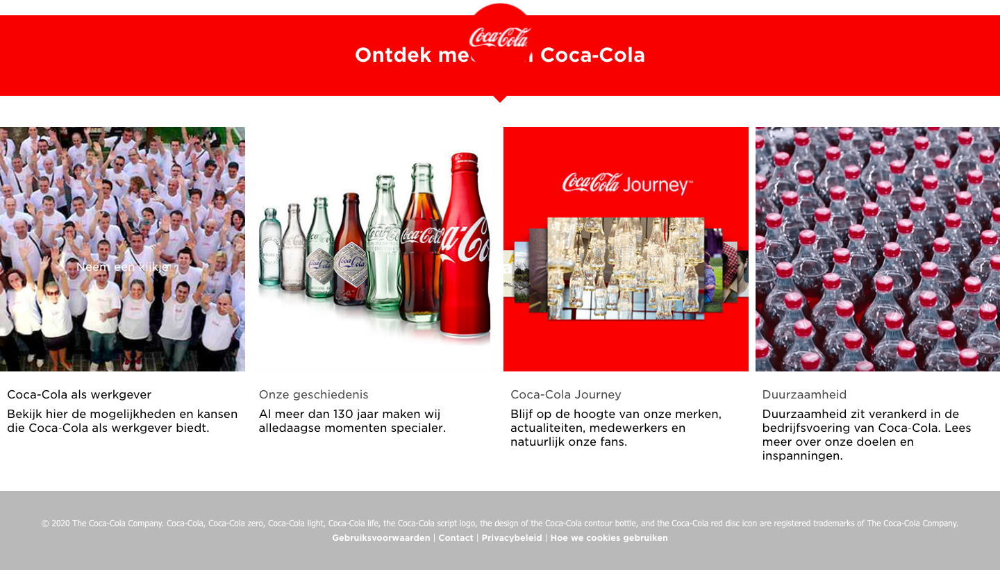

# Procesverslag
**Auteur:** -Jade Dionisio Pires-

Markdown cheat cheet: [Hulp bij het schrijven van Markdown](https://github.com/adam-p/markdown-here/wiki/Markdown-Cheatsheet). Nb. de standaardstructuur en de spartaanse opmaak zijn helemaal prima. Het gaat om de inhoud van je procesverslag. Besteedt de tijd voor pracht en praal aan je website.

## Bronnenlijst
1. - https://www.digitalocean.com/community/tutorials/css-cropping-images-object-fit -
2. - https://stackoverflow.com/questions/14263594/how-to-show-text-on-image-when-hovering#:~:text=Wrap%20the%20image%20and%20the,appear%20while%20hovering%20that%20div.&text=You%20can%20also%20do%20the,alt%20text%20of%20your%20image. -

## Eindgesprek (week 7/8)

-dit ging goed & dit was lastig-

**Screenshot(s):**

-screenshot(s) van je eindresultaat-

## Voortgang 3 (week 6)

Deze week was ik als enige van mijn clubje aanwezig wat betekend dat ik heel veel hulp heb kunnen krijgen van docentbegeleider las Lars. 
Ik heb de volgende dingen aangepast: navigatie is netter, geen witruimte, valt over de rest van de pagina en het logo is groter; toevoegen van een background-image aan de header, verbeteren van het grid, specifieker maken van de hover over de afbeeldingen (zat verschil tussen de 2 sections), footer neemt niet meer de styling aan van de navigatie in de header.

Dit moet ik nog gaan aanpassen voor de beoordeling: mediaqueries voor background image, vormgeving strakker maken, tweede pagina juist indelen, toegankelijkheid. 

Dit kan ik eventueel nog aanpassen, als ik tijd heb:
header background veranderen bij scroll d.m.v. javascript, driehoekjes onder de heading van de sections toevoegen. 

## Voortgang 2 (week 5)
Docent Danny heeft tijdens deze voortgang naar mijn website gekeken. Ik kreeg complimenten voor mijn HTML en mijn CSS zag er ook prima uit. Danny heeft me geholpen om zowel mijn grid als hamburger menu werkend te maken. Voor volgend voortgangsgesprek moet ik de volgende aspecten nog aanpassen:

- 'Kinderziektes' weghalen (strakkere vormgeving) en dus nog iets beter ansluiten bij de huisstijl van Coca Cola
- Toevoegen van een detailpagina
- Kijken of ik voldoe aan de eisen van het beoordelingsformulier

## Voortgang 1 (week 3)
Docentbegeleider Lars heeft naar mijn website gekeken en gaf me de onderstaande tips:

- Als je een hamburgermenu gaat maken, moet je erop letten dat deze navigatie niet 'hidden' is aangezien het dan niet toegankelijk is voor screenreaders.

-Bij de hover op de afbeeldingen kan je een transition toevoegen zodat het er wat fijner uitziet

-De tekst over de afbeelding hoveren kan je beter doen door middel van figure i.p.v div

Ik ben van plan deze tips nog toe te passen in de volgende weken, verder vond Lars mijn website er tot nu toe prima uitzien. 

### Stand van zaken

-dit ging goed & dit was lastig -

Week 1 
In week 1 heb ik de huiswerkopdrachten gemaakt, wat best goed verliep. Ik heb gekozen om de Coca-Cola website na te maken en heb de read-me ingevuld, aan de html/css/java heb ik niks toegevoegd. Met de huiswerkoefeningen heb ik geleerd hoe ik teksten kan aanpassen. Helaas kon ik die week niet bij de werkgroep zijn dus heb ik daar ook niets toegevoegd aan mijn werk.  

Week 2
Deze week heb ik de oefeningen over positionering gemaakt en heb ik super veel geleerd over de plaatsing van de elementen, dit ging erg goed. Danny raadde ons aan om alvast te beginnen met onze eigen website en dat heb ik ook gedaan. Ik had de basis van HTML, de kopjes p en afbeeldingen, toegevoegd en had de CSS even achterwege gelaten. Dit kostte helaas meer tijd dan ik had verwacht waardoor ik geen tijd heb gehad om te oefenen met flexbox. Wel heb ik de theorie doorgenomen. Ik ben van plan de oefeningen op een ander moment alsnog te maken.

Week 3
Deze week heb ik oefeningen van Javascript gemaakt en ik moet eerlijk zeggen dat ik er helemaal draaierig van werd. Tijdens de werkgroep legde Danny gelukkig duidelijk uit hoe alles werkte, zodat ik het beter begreep. De rest van de week heb ik hard aan mijn eigen website gewerkt. Ik begon met de navigatie, die een hamburger menu heeft, maar begreep er al vrij snel niets van. Ik heb ervoor gekozen mij dus eerst te gaan richten op de rest van de website, wat gelukkig erg goed ging en ik kreeg weer wat hoop. Ik heb toegepast wat ik vorige week heb geleerd m.b.t positionering en teksten. Zo heb ik d.m.v positionering tekst op afbeelding zichtbaar gemaakt met een hover. Ook heb ik de vormgeving iets mooier gemaakt. De mobile first van de eerste pagina is nu zo goed als af, op de navigatie na. Ik ben van plan eerst de flexbox opdrachten van week 2 te maken en als ik het dan nog niet begrijp hulp te vragen aan een docent assistent. 

Week 4
Ik heb oefeningen met Grid en Media Queries gemaakt. Hier heb ik vorig jaar ook mee gewerkt en ik merk dat ik het nu makkelijker (vind klinken) dan voorheen dus dat is echt een vooruitgang. Ik kijk er naar uit dit toe te passen op mijn website maar heb er deze week helaas geen tijd voor omdat mijn Behaviour Design vakken extreem veel tijd in beslag nemen. Ik hoop volgende week nog het een en ander te kunnen doen voor het volgende voortgangsgesprek.

Week 5
Ik heb het super druk gehad en het kwam helaas niet uit om maandag de les bij te wonen, ik heb een middag hard gewerk aan mijn website maar heb helaas minder kunnen doen dan gehoopt, ik moet komende week nog even hard aan de slag voor het laatste voortgangsgesprek van volgende week. 
Dit heb ik aangepast sinds vorig voortgangsgesprek:
- Grid toegevoegd
- Div's vervangen met figures 
- Transition toegevoegd aan de afbeeldingen
- Schaduw toegevoegd aan figcaption zodat tekst leesbaar   is (verbetering van echte website)
- Navigatie hamburgermenu

Week 6
Begin deze week heb ik geoefend met toegankelijkheid, wat ik erg interessant vond. Verder ben ik veel gaan uitproberen met mijn eigen site. Dit ging echter helemaal mis wat veel frustraties opleverde. Het gebeurde vaak dat elementen niet (juist) aangesproken werden. Ik hoop meer duidelijkheid te krijgen over deze onderwerpen tijdens het laatste voortgangsgesprek.
In vergelijking met vorige week heb ik nu een Tweede pagina toegevoegd. Daarnaast heb ik de hover van de afbeeldingen op de homepagina soepeler laten verlopen. 

Weken tot aan beoordeling - Week 7 en 8
De laatste weken heb ik mijn site tot in de puntjes uitgewerkt. Ik heb de afbeelding van de header op de index pagina veranderd van bron met een mediuequery zoals de orginele site dit ook heeft gedaan, waardoor de site meer responsive is geworden. 

Ik heb de kinderziektes, zoals Danny dat zelf zegt, verwijderd uit de navigatie van de header en de footer waardoor alles er nu strak uitziet. 

De detailpagina is nu responsive en vormgegeven zoals het orgineel. 

### Agenda voor meeting
Agende donderdag 17 sept:
Jan Willem van Kempen 
Items (list) naast elkaar plaatsen, witte regels tussen afbeeldingen, tekst verdwijnen achter afbeeldingen

Souraya Hammaoui 
Grid, carrousel

Walter van Koesveld
Bovenstaande punten

Jade Dionisio Pires
Navigatie in header en footer

Agenda donderdag 30 sept:
Jade Dionisio Pires
Column gap wordt ineens heel groot
3 column grid claimt een plek voor een 4e column die er niet is
alle fbeeldingen behalve de eerste zijn heel smal in het grid
javascript werkt niet

Walter van Koesveld
Image repeat
Lijst met kolommen die niet goed te verdelen zijn

Jan Willem van Kempen
Grid in hamburger menu werkt niet
Hamburger menu is niet scrollbaar
Transparant border uitgevouwen hamburgermenu
Text wil niet centreren

Agenda donderdag 8 oktober:
Jade Dionisio Pires
Witruimte om nav die niet weggaat
Nav als overlay over content laten vallen (ook als main content fixed is)
Footer neemt nav over van nav:first-of-type
Background image toevoegen werkt niet / hoe maak je de maten groter
Grid neemt altijd een 4e column in ook als deze niet bestaat
Content 2e pagina niet aanspreekbaar zonder dat homepage mee veranderd

### Verslag van meeting

Zie informatie bij voortgang per week

## Intake (week 1)

**Je startniveau:** blauw / rood

**Je focus:** -Responsive-

**Je opdracht:** -https://www.cocacola.nl/nl/home/-

**Screenshot(s):**

 
 
 

**Breakdown-schets(en):**

